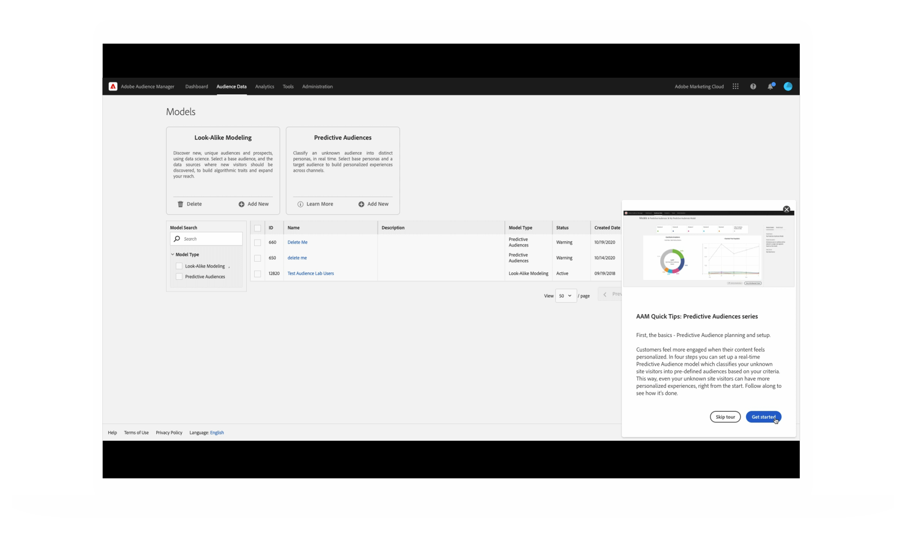
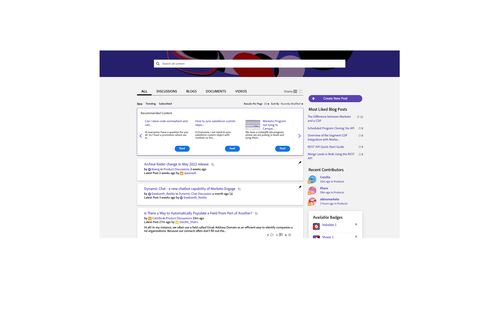

# Personalized learning recommendations and promotions

You can choose to allow us to provide you with helpful content that is tailored to you based on your work in your Adobe products. Select your preferences from the options below, and you'll be provided learning information that is relevant to:

* Your skill level and role
* Your workflows
* Features you'll likely use
* And more!

{width="10%"}

You can update your selections at any time in [User Preference Settings](https://experience.adobe.com/preferences/).

## Personalized training and support recommendations for your Adobe products and services

<table>
<thead>
  <tr>
    <th colspan="3">Personalized training and support recommendations for your Adobe products and services</th>
  </tr>
</thead>
<tbody>
  <tr>
    <td colspan="3">Receive relevant best practices, tips & tricks, helpful walk throughs, and more based on your use of your Adobe products in each of these three ways...</td>
  </tr>
  <tr>
    <td>In your Adobe products... </td>
    <td>See pop ups and tool tips for real-time help.</td>
    <td rowspan="3">This could include... <ul><li>Step by step guides and helpful tips from Adobe experts</li> 
    <li>Video tutorials and informational walkthroughs</li> 
    <li>In-depth training and education</li> 
    <li>Recommendations for videos and posts</li>
    </ul></td>
  </tr>
  <tr>
    <td>In email Adobe sends you...</td>
    <td>Seeing learning content that relates to your work in your product(s).</td>
  </tr>
  <tr>
    <td>In the Experience League Communities..</td>
    <td>See personalized recommendations for posts and articles based on what you're doing now.</td>
  </tr>
</tbody>
</table>

## Personalized information about Adobe products, services, events, and promotions

<table>
<thead>
  <tr>
    <th colspan="3">Personalized information about Adobe products, services, events, and promotions</th>
  </tr>
</thead>
<tbody>
  <tr>
    <td colspan="3">Receive tailored opportunities for learning events, research sessions, and integrations based on your work in each of these three ways...</td>
  </tr>
  <tr>
    <td>In your Adobe products... </td>
    <td>See pop ups and tool tips for invitations and opportunities relevant to you.</td>
    <td rowspan="3">This could include... <ul>
    <li>Invitations to educational webinars and events</li> 
    <li>Opportunities to test and give input on future releases of the features you use</li>
    <li>Tips to use integrations between products you own</li> 
    <li>Highlights for key sessions at the Adobe Summit conference based on your work</li>
    </ul></td>
  </tr>
  <tr>
    <td>In email Adobe sends you...</td>
    <td>Get timely information from Adobe about additional learning opportunities.</td>
  </tr>
  <tr>
    <td>In the Experience League Communities..</td>
    <td>See personalized recommendations for events and services to enhance your learning.</td>
  </tr>
</tbody>
</table>

{width="10%"}

## See examples of how this customized learning information might look.

### In your Adobe products

{width="800"}

### In email Adobe sends you

{width="400"}

### In the Experience League Communities

{width="800"}

{width="10%"}
